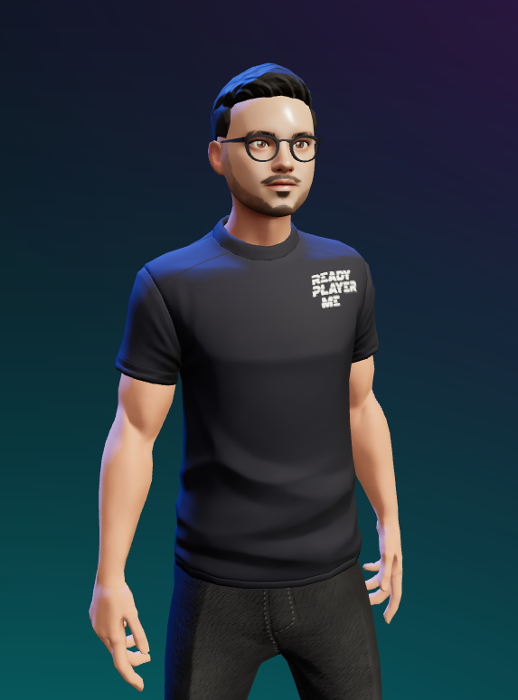

# Hi, Everyone! 👋 

<table>
  <tr>
    <td>
        
    </td>
    <td>
      I’m Arindam. A dedicated developer with a passion for transforming ideas into reality.
   </td>
  </tr>
</table>

<!-- 

-->

<!--
-->

## 🌟 My Journey

I've had the opportunity to grow my skills at:

<table>
  <tr>
    <td><strong><a href="https://iiitdm.ac.in">IIITDM Kancheepuram</a></strong></td>
    <td>CS22 student</td>
  </tr>
  <tr>
    <td><strong><a href="https://vassarlabs.com">Vassar Labs</a></strong></td>
    <td> SDE Intern</td>
  </tr>
  <tr>
    <td><strong><a href="https://kla.com">KLA Tencor</a></strong></td>
    <td>SDE Intern</td>
  </tr>
  <tr>
    <td><strong><a href="https://lnw.com">Light & Wonder</a></strong></td>
    <td>Senior Associate Software Engineer</td>
  </tr>
</table>

Tackling challenges and building impactful solutions.

## 🛠️ Tech Stack

<table>
  <tr>
    <td><strong>Programming Languages</strong></td>
    <td>
       
       
       
       
       
    </td>
  </tr>
  <tr>
    <td><strong>Web Development Frameworks & Tools</strong></td>
    <td>
       
       
       
       
       
       
       
       
    </td>
  </tr>
  <tr>
    <td><strong>DevOps & Databases</strong></td>
    <td>
      
      
      
      
    </td>
  </tr>
  <tr>
    <td><strong>Tools / Software</strong></td>
    <td>
      
      
      
      
      
    </td>
  </tr>
</table>

<!--
## 📫 Let’s Connect

<table>
  <tr>
    <td>I’m always looking to collaborate on exciting projects or discuss tech trends. Reach out to me at:</td>
  </tr>
  <tr>
    <td>
       
      
      
      
      
    </td>
  </tr>
  <tr>
    <td style="font-size: 1.1em; color: #555;">✨ Together, let’s push the boundaries of what’s possible! 🚀</td>
  </tr>
</table>
-->
## 📫 Let’s Connect

I'm always looking to collaborate on exciting projects or discuss tech trends. Reach out to me at:
       

   
   
✨ Together, let’s push the boundaries of what’s possible! 🚀
  
