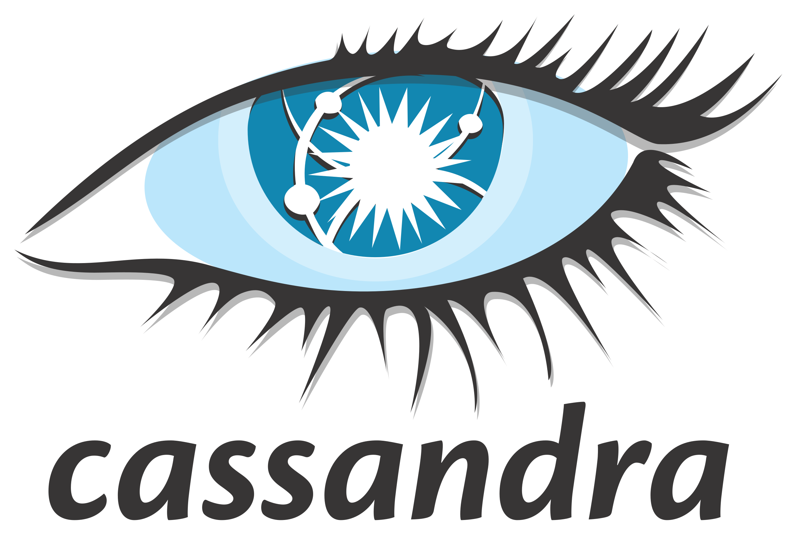

# Arindam Sharma 

 
<!--   -->
<!--  -->

* CSE'22 Grad [@IIITDM Kancheepurem](https://iiitdm.ac.in)
* Ex-Intern (May21-Nov21)[@Vassar Labs](https://vassarlabs.com)
* Ex-Intern (May22-Aug22)[@KLA Tencor](https://kla.com)
* ASE (Nov22-Present)[@Light & Wonder (AKA Scientific Games)](https://lnw.com)

* Interset Areas:
    * Software Developement
    * Application Development
    * Data Structure

# Stats

<!--  -->

<!--  -->

<!-- # Github Contributers

 -->

# Contact 
<!--   -->

 

## Coding Platforms

 
 
 
 
 

## Social Media

# Technologies

## Programming Languages

## DataBase Tools

## Tools / Software

<!--
**ArindamSharma/ArindamSharma** is a ✨ _special_ ✨ repository because its `README.md` (this file) appears on your GitHub profile.

Here are some ideas to get you started:

- 🔭 I’m currently working on ...
- 🌱 I’m currently learning ...
- 👯 I’m looking to collaborate on ...
- 🤔 I’m looking for help with ...
- 💬 Ask me about ...
- 📫 How to reach me: ...
- 😄 Pronouns: ...
- ⚡ Fun fact: ...
-->

<!-- ## 😂 Here is a random joke that'll make you laugh!
 -->

